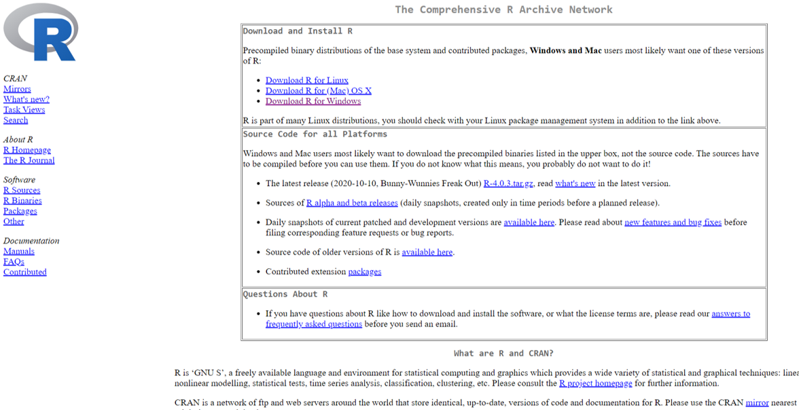
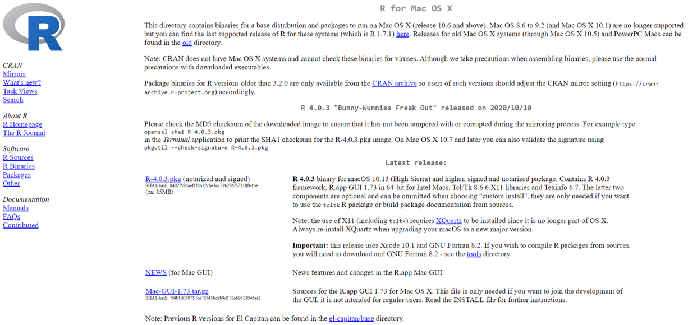
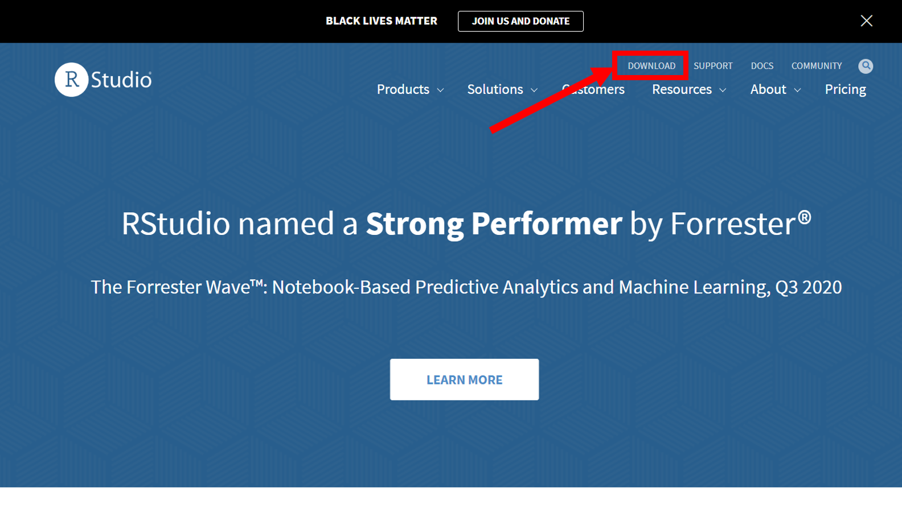
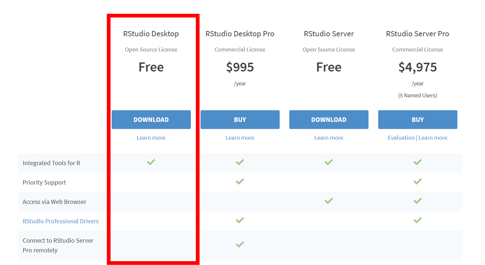
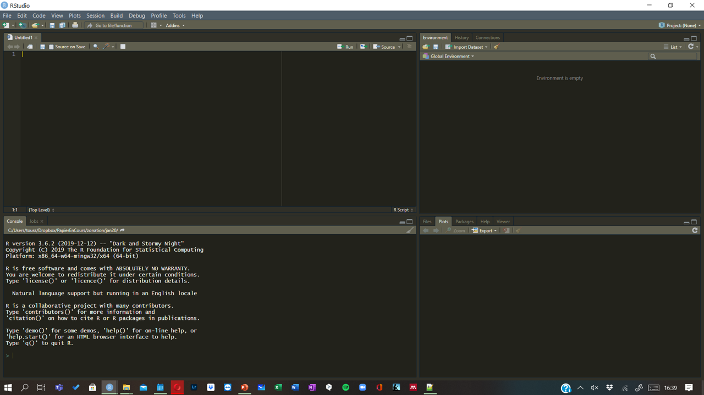

  
```{r setup, include=FALSE}
knitr::opts_chunk$set(echo = TRUE)
```

<h1 align="center"><b> Install R </b></h1>
******************
<br>  

## **Windows**
  
Installing R on **Windows** is very straightforward. The easiest way is to install it through CRAN.
Just visit the [CRAN download page](https://cran.r-project.org) and select *Download R for Windows* as showed in the following Figure.
  


Then click on **install R for the first time**.

Then click on **Download R 4.0.3 for Windows**.

The setup is downloading in your computer. When it finish, **install** it on your computer as any other software.

**************
<br>

## **Mac**
  
For **mac** users, click on **Download R for (Mac) OS X** and **R-4.0.3.pkg**. 
The setup is downloading in your computer. When it finish, **install** it on your computer as any other software.  
  


**********************************
<br>

## **Linux**

For **Linux** user, click on **Download R for Linux** and follow the **command lines**

*****************************************************  
<br><br>
  
<h1 align="center"><b> Install RStudio </b></h1>
  
You need to go to [RStudio website](https://rstudio.com) and **download**
  
  


and then choose the <font size="3"> **FREE** version </font>.




Finally, **select** you favorite OS (windows, mac or linux) and follow instructions. 

*****************************************************  
<br>
If everything is working, you can open your __*RStudio*__. You are ready to use __R__ 
  
  


--------------
<h4>If you have any trouble, contact me: aurele.toussaint@ut.ee</h4>
---------------


